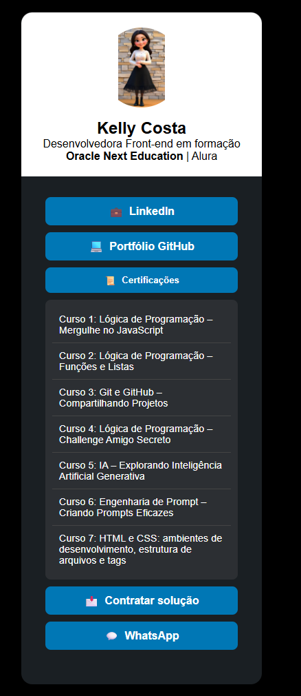

# 💻 Card de Perfil - Desenvolvedora Front-end

Este projeto é um card de apresentação profissional, desenvolvido em HTML, CSS e JavaScript, com foco em **estilização moderna e informações interativas**. Foi criado como parte da formação no programa **Oracle Next Education** em parceria com a **Alura**.

## 👩‍💻 Sobre Mim

**Kelly Costa**  
Desenvolvedora Front-end em formação  
Programa: **Oracle Next Education | Alura**

---

## 🌐 Acesse Meus Perfis

- 🔗 [LinkedIn](#)  
- 💻 [Portfólio GitHub](#)  
- 📄 [Certificações](#)

---

## 📚 Cursos Concluídos

1. **Lógica de Programação – Mergulhe no JavaScript**
2. **Lógica de Programação – Funções e Listas**
3. **Git e GitHub – Compartilhando Projetos**
4. **Lógica de Programação – Challenge Amigo Secreto**
5. **IA – Explorando Inteligência Artificial Generativa**
6. **Engenharia de Prompt – Criando Prompts Eficazes**
7. **HTML e CSS – Ambientes de desenvolvimento, estrutura de arquivos e tags**

---

## 🚀 Tecnologias Utilizadas

- HTML5
- CSS3
- JavaScript (básico)
- Layout responsivo (mobile first)
- Estilização moderna com cores e ícones

---

## 📱 Funcionalidades

- Card de perfil com imagem
- Botões interativos para LinkedIn, GitHub, Certificações e Contato
- Listagem de cursos realizados
- Layout responsivo para diferentes tamanhos de tela

---

## 🧩 Como Usar

1. Clone o repositório:
   ```bash
   git clone https://github.com/seu-usuario/nome-do-repositorio.git


